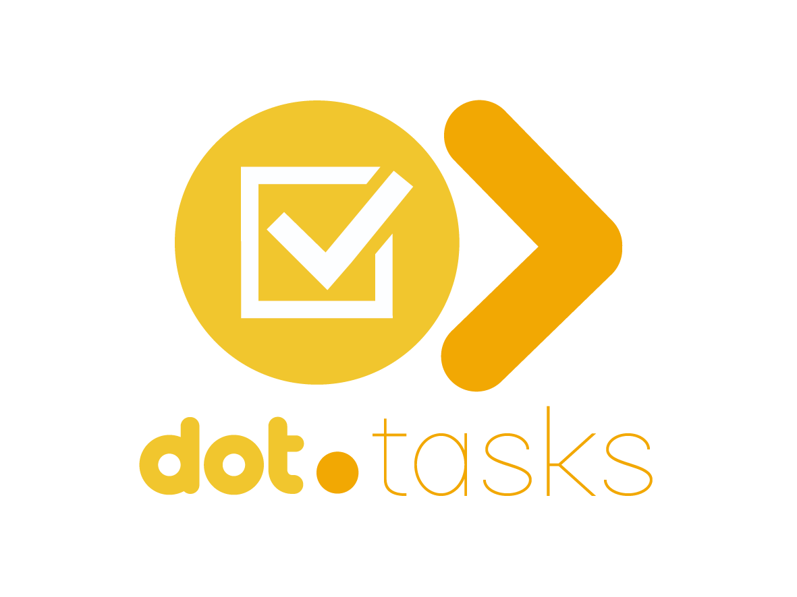

<div align="center">



<br /><br />

**Break down complex work into subtasks with time estimates and track everything on kanban.**

<br />

   

<br /><br />

**Part of the [InfoDot Ecosystem](https://github.com/sakhileb/InfoDot)** &nbsp;·&nbsp; `tasks.infodot.app`

</div>

---

## What is Dot.Tasks?

Dot.Tasks is the personal and team task management platform in the InfoDot ecosystem. AI decomposes complex goals into subtasks with time estimates; a flexible kanban board and list view let every team member manage their workload their way.

## Core Features

- AI task decomposition — break any goal into actionable subtasks, with time estimates per subtask (falls back to a fixed mock breakdown when `ANTHROPIC_API_KEY` is unset)
- Drag-and-drop kanban board with search/filter by title or description
- Task assignment, scoped server-side to the task's team
- In-app notification bell (task assigned, new comment, task due soon) backed by Laravel's `database` notification channel
- Labels, priorities, and due dates
- Dashboard KPIs: total lists/tasks, in progress, completed, due today, overdue, completed this week
- Class-based dark/light theme toggle
- Ecosystem SSO from InfoDot hub

> Recurring tasks/schedules, calendar view, and a built-in Pomodoro timer are **not implemented** — see `wiki.md` §8 for the full gap list against the original aspirational feature set.

## Domain Models

- **TaskList** — a board; owns many tasks
- **Task** — unit of work with status, priority, optional assignee and due date; subtasks are just tasks with a `parent_id`
- **Label** — colour-coded category tag, many-to-many with tasks
- **TaskComment** — discussion on a task
- **AiBreakdownLog** — prompt/response audit trail for each AI decomposition call

## Tech Stack

| Layer | Technology |
|---|---|
| Framework | Laravel 12 |
| Language | PHP 8.4 |
| Frontend | Livewire 3 · Alpine.js 3 · Tailwind CSS |
| Database | PostgreSQL 16 (shared across ecosystem) |
| Realtime | Laravel Reverb |
| Auth | Laravel Sanctum (InfoDot SSO) |
| AI | Anthropic Claude (`claude-sonnet-4-6`) |
| Storage | AWS S3 / Local (Flysystem) |
| Search | Laravel Scout · Meilisearch |
| Queue | Redis · Laravel Horizon |

## Quick Start

```bash
git clone https://github.com/sakhileb/Dot.Tasks.git
cd Dot.Tasks
cp .env.example .env
composer install
npm install && npm run build
php artisan key:generate
php artisan migrate
php artisan serve
```

> **Ecosystem SSO:** Set `DB_*` env vars to the shared InfoDot PostgreSQL instance and `APP_URL=https://tasks.infodot.app`. Users authenticated through InfoDot gain access automatically via Sanctum handoff tokens.

## 🚢 Deployment

### Production Checklist

1. **Set environment**
   ```bash
   APP_ENV=production
   APP_DEBUG=false
   ```

2. **Install dependencies (no dev)**
   ```bash
   composer install --optimize-autoloader --no-dev
   npm ci
   ```

3. **Build frontend assets**
   ```bash
   npm run build
   ```

4. **Cache configuration**
   ```bash
   php artisan config:cache
   php artisan route:cache
   php artisan view:cache
   php artisan event:cache
   ```

5. **Run migrations**
   ```bash
   php artisan migrate --force
   ```

6. **Start the queue worker** (use `deploy/queue-worker.service` for systemd or `deploy/queue-worker.supervisord.conf` for Supervisor). Requires `QUEUE_CONNECTION=redis`, matching `.env.production.example`.
   ```bash
   php artisan queue:work redis --tries=3 --timeout=90
   ```

7. **Start the Reverb WebSocket server** (use `deploy/reverb.service` for systemd or `deploy/reverb.supervisord.conf` for Supervisor) -- never run this as a bare foreground command in production, it needs the same process supervision as the queue worker.
   ```bash
   php artisan reverb:start
   ```
   Binds to `REVERB_SERVER_HOST`/`REVERB_SERVER_PORT` (loopback-only by default in `.env.production.example`) -- it is not meant to be reachable directly from the internet. See "WebSocket Reverse Proxy" below for how browsers actually reach it over `wss://`.

### Web Server Configuration

#### Nginx

```nginx
server {
    listen 80;
    server_name your-domain.com;
    return 301 https://$host$request_uri;
}

server {
    listen 443 ssl;
    http2 on;
    server_name your-domain.com;
    root /var/www/tasks/public;

    ssl_certificate     /etc/letsencrypt/live/your-domain.com/fullchain.pem;
    ssl_certificate_key /etc/letsencrypt/live/your-domain.com/privkey.pem;

    add_header X-Frame-Options "SAMEORIGIN";
    add_header X-Content-Type-Options "nosniff";

    index index.php;
    charset utf-8;

    location / {
        try_files $uri $uri/ /index.php?$query_string;
    }

    location = /favicon.ico { access_log off; log_not_found off; }
    location = /robots.txt  { access_log off; log_not_found off; }

    error_page 404 /index.php;

    location ~ \.php$ {
        fastcgi_pass unix:/var/run/php/php8.4-fpm.sock;
        fastcgi_param SCRIPT_FILENAME $realpath_root$fastcgi_script_name;
        include fastcgi_params;
    }

    location ~ /\.(?!well-known).* {
        deny all;
    }

    # WebSocket Reverse Proxy -- only Reverb's client-facing path
    # (/app/{key}, what Echo/pusher-js connects to) is proxied here. Its
    # server-to-server publish API (/apps/{id}/events etc.) is deliberately
    # NOT exposed publicly -- config/broadcasting.php's reverb connection
    # talks to it directly over the internal REVERB_SERVER_HOST/PORT
    # instead, so it never needs to be reachable from outside this box.
    # The Upgrade/Connection headers are what turn this from a plain HTTP
    # proxy into a WebSocket one; without them the client's protocol
    # upgrade handshake fails.
    location /app {
        proxy_pass http://127.0.0.1:8080;
        proxy_http_version 1.1;
        proxy_set_header Upgrade $http_upgrade;
        proxy_set_header Connection "upgrade";
        proxy_set_header Host $host;
        proxy_set_header X-Real-IP $remote_addr;
        proxy_set_header X-Forwarded-For $proxy_add_x_forwarded_for;
        proxy_set_header X-Forwarded-Proto $scheme;
        proxy_read_timeout 60s;
    }
}
```

#### Apache

Requires `mod_proxy`, `mod_proxy_wstunnel`, and `mod_ssl` enabled (`a2enmod proxy proxy_wstunnel ssl`).

```apache
<VirtualHost *:80>
    ServerName your-domain.com
    Redirect permanent / https://your-domain.com/
</VirtualHost>

<VirtualHost *:443>
    ServerName your-domain.com
    DocumentRoot /var/www/tasks/public

    SSLEngine on
    SSLCertificateFile      /etc/letsencrypt/live/your-domain.com/fullchain.pem
    SSLCertificateKeyFile   /etc/letsencrypt/live/your-domain.com/privkey.pem

    <Directory /var/www/tasks/public>
        AllowOverride All
        Require all granted
    </Directory>

    ProxyPass        /app ws://127.0.0.1:8080/app
    ProxyPassReverse /app ws://127.0.0.1:8080/app
</VirtualHost>
```

### Real-Time Health Check

`GET /up/realtime` checks broadcasting config, queue connection, and whether `reverb:start` is actually accepting connections -- independently, so it reports which link broke rather than a single healthy/unhealthy bit. See `app/Http/Controllers/RealtimeHealthController.php`.

---

## Ecosystem

**Dot.Tasks** is one of **21 platforms** in the InfoDot ecosystem, connected via shared PostgreSQL and Sanctum SSO. Visit [InfoDot](https://github.com/sakhileb/InfoDot) to explore the full platform map.

## License

MIT © [SK Digital / BluPin Incorporated](https://github.com/sakhileb)
