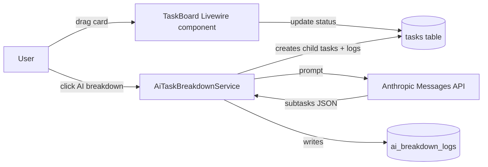

# Dot.Tasks

Purpose: this is Dot.Tasks's own knowledge home — owned and maintained by the Dot.Tasks team. It describes what this platform actually is, what it stores, and how it connects to the wider Dot Ecosystem. Dot.Brain never edits this file; it only reads what we choose to publish.

> **Related:** [Dot.Brain's ingested view of this platform](https://github.com/sakhilebhayi/Dot.Brain/blob/main/platforms/dot-tasks.md)

---

## 1. What Dot.Tasks Is

Dot.Tasks is the personal and team task-execution surface in the Dot Ecosystem: AI decomposes a goal into subtasks with time estimates, and a kanban board plus list view let each team member run their own workload. It is a Laravel 12 / Livewire 3 application — Sanctum handles ecosystem SSO, PostgreSQL is the shared datastore, and Anthropic's API powers the decomposition feature.

**Status:** working prototype. Core CRUD, kanban movement, AI breakdown, and ecosystem SSO are implemented and covered by tests. Recurrence, queues, and knowledge-pack publishing are not built yet — see §9 Roadmap for the gap between what ships today and what Dot.Brain's ingested view (§ below) describes as this platform's long-run role.

## 2. Architecture

| Layer | Technology | Notes |
|---|---|---|
| Framework | Laravel 12, PHP 8.4 | `app/`, `routes/web.php` |
| UI | Livewire 3, Alpine.js, Tailwind | `app/Livewire/Tasks/*`, `resources/views/livewire/tasks/*` |
| Database | PostgreSQL 16 | shared instance across the ecosystem |
| Auth | Laravel Sanctum | ecosystem SSO handoff, see §5 |
| AI | Anthropic Claude (`claude-sonnet-4-6`) | `app/Services/AiTaskBreakdownService.php` |
| Queue/Realtime | Redis, Laravel Horizon, Laravel Reverb | declared in stack; not yet wired into task workflows |
| Search | Laravel Scout + Meilisearch | declared in stack; not yet wired |

Request flow for the two things a user actually does today:

`AiTaskBreakdownService` degrades gracefully: if `ANTHROPIC_API_KEY` is unset, `isConfigured()` returns false and `mockBreakdown()` returns a fixed five-step template instead of failing the request — useful for local dev and for keeping the feature demoable without a live key.

## 3. Domain Entities

As actually modeled in `database/migrations/2026_06_27_000001_create_tasks_tables.php` and `app/Models/`:

| Entity | Table | Natural key / relations | Notes |
|---|---|---|---|
| `TaskList` | `task_lists` | team + owner | A board; owns many tasks, has a color and sort order |
| `Task` | `tasks` | belongs to `TaskList`; optional `parent_id` self-reference | `status` ∈ {todo, in_progress, review, done}; `priority` ∈ {low, medium, high, urgent}; optional `assignee_id`, `due_date`, `estimated_minutes` |
| `Task` (subtask) | `tasks` (self-join) | `parent_id` on `Task` | Subtasks are just tasks with a parent — AI-generated or manual, no separate table |
| `Label` | `labels` | team-scoped | Colour-coded tag |
| `task_label` | pivot | task × label | Many-to-many |
| `TaskComment` | `task_comments` | task + user | Flat discussion thread |
| `AiBreakdownLog` | `ai_breakdown_logs` | task + user | Prompt, response, and token count for every AI decomposition call — the audit trail for the AI feature |

Note on vocabulary: Dot.Brain's ingested view (linked above) describes this platform at the "routine" granularity — recurring inspection rounds, maintenance checklists, standing queues — with a `Queue` entity and instance-level completions that never graph individually. None of that exists in the schema yet: today's `Task`/`TaskList` model is a general-purpose kanban with parent/child subtasks, not a recurrence engine. We're carrying the routine-vs-project boundary language forward as design intent (§9), not as shipped behavior.

## 4. Events Emitted

The application does not currently dispatch Laravel domain events or publish anything externally — there is no `app/Events/` directory and no outbound integration beyond the Anthropic API call and the Sanctum SSO handoff. State changes (task moved, task created, AI breakdown run) are persisted directly by the Livewire components and the service class; nothing is broadcast today, despite Reverb being declared in the stack.

Planned event surface, aligned to what Dot.Brain's ingested view expects to consume (see §5): `routine.instance.completed`, `routine.instance.overdue`, `routine.template.escalated`, and `routine.queue.health_shift`. Emitting these — and deciding what a "template" and "queue" map to in this schema — is the first architecture gap to close before Tasks can publish anything.

## 5. Connecting to Dot.Brain

Dot.Tasks participates in the ecosystem as a registered platform (`dot-tasks`). Today the connection is limited to shared infrastructure — the same PostgreSQL instance and Sanctum-issued ecosystem tokens (`app/Http/Controllers/Auth/EcosystemAuthController.php` accepts a token scoped `ecosystem:read`, logs the user in, and deletes the one-time token). No Knowledge Pack publishing pipeline exists in this repo yet.

Dot.Brain's ingested view of this platform frames the eventual contract:

| Payload type | Cadence | Contains (per Dot.Brain's expectation) |
|---|---|---|
| `observation` | weekly | template completion/rework aggregates |
| `insight` | per finding | routine-design findings (e.g. checklist steps that predict rework) |
| `outcome` | per verified recommendation | recommendation-verification results |
| `incident` | per incident | routine failures with ecosystem-wide lessons |

Two design commitments from that document we intend to honor once publishing exists, because they're the right call independent of Dot.Brain: never surface a done-rate without its paired rework-rate (the lesson from Dot.Dopemine's 2026-05 completion-streak decertification, which happened on this platform), and never publish or rank individual assignees — only role-level, structural aggregates.

**Boundary with Dot.Projects:** the intended split, as stated in Dot.Brain's doc, is that Dot.Projects owns work with an end date and Dot.Tasks owns work that recurs. In the current schema there is no recurrence field and no project-to-task-template spawn path, so that boundary is not yet enforced anywhere in code — it's a target for the data model, not a fact about it today. A sibling agent is independently writing Dot.Projects's own wiki.md; the two documents should describe the same seam without either overriding the other, since each platform owns its own file.

Full manifest, entity/event mapping, worked publish→PR round-trips, and the tenancy/aggregation-floor rules are maintained on the Brain side at [`platforms/dot-tasks.md`](https://github.com/sakhilebhayi/Dot.Brain/blob/main/platforms/dot-tasks.md) — that document is Dot.Brain's ingested view and is authoritative for integration mechanics; this wiki is authoritative for what Dot.Tasks actually *is*.

## 6. Testing

`tests/TestCase.php` is the base test case; `phpunit.xml` configures the suite; `bin/test.sh` is the local test runner. Test coverage tracks the implemented surface (auth, teams, task CRUD) rather than the aspirational routine/queue model.

## 7. Configuration

Key environment variables (`.env.example`): standard Laravel/Postgres/mail settings, `ANTHROPIC_API_KEY` and `ANTHROPIC_MODEL` for the breakdown feature (defaults to `claude-sonnet-4-6`, falls back to a mock breakdown when unset), and the shared ecosystem `DB_*` connection plus `APP_URL=https://tasks.infodot.app` for SSO.

## 8. Known Gaps vs. Ecosystem Framing

- No recurrence model: `Task` has `due_date` but no schedule/cadence field, so "recurring tasks with configurable schedules" (README feature list) is not yet backed by schema.
- No `Queue` concept, no template/instance split, no escalation path to Dot.Projects.
- No outbound event dispatch or Knowledge Pack publishing — the entire §5 contract is a target, not a running pipeline.
- Reverb (realtime) and Scout/Meilisearch (search) are declared dependencies with no corresponding application code yet.

## 9. Roadmap

- [ ] Add recurrence fields to `Task`/`TaskList` (or a new `TaskTemplate` entity) to back the routine-vs-project boundary
- [ ] Introduce a `Queue` entity and instance-level completion tracking, matching Dot.Brain's expected granularity
- [ ] Dispatch domain events (`task.completed`, `task.overdue`, eventually the `routine.*` names) on real state transitions
- [ ] Build the Knowledge Pack publishing pipeline (observation/insight/outcome/incident) with the done-rate/rework-rate pairing enforced structurally, not just documented
- [ ] Wire Reverb for realtime board updates and Scout/Meilisearch for task search
- [ ] Define the actual escalation path from a failing recurring task to a Dot.Projects handoff

## Change Log

| Version | Date | Author | Change |
|---|---|---|---|
| 0.2.0 | 2026-08-01 | Tasks Platform Lead | Initial wiki: derived from the actual Laravel/Livewire codebase (kanban, AI breakdown, ecosystem SSO), cross-referenced against Dot.Brain's platforms/dot-tasks.md for ecosystem framing, gaps between shipped code and the routine/queue model called out explicitly |

## Open Questions

- Does the routine/queue model replace the current flat `Task`/subtask schema, or layer on top of it as a separate `TaskTemplate` abstraction?
- What does "task-template spawn" from a closed Dot.Projects project concretely look like at the API/event level, given neither platform has that integration built yet?
- Should AI breakdown logs (`ai_breakdown_logs`) feed the `insight` Knowledge Pack once publishing exists, or stay purely internal audit data?
