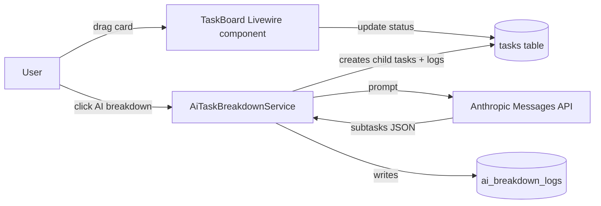

# Dot.Tasks

Purpose: this is Dot.Tasks's own knowledge home — owned and maintained by the Dot.Tasks team. It describes what this platform actually is, what it stores, and how it connects to the wider Dot Ecosystem. Dot.Brain never edits this file; it only reads what we choose to publish.

> **Related:** [Dot.Brain's ingested view of this platform](https://github.com/sakhilebhayi/Dot.Brain/blob/main/platforms/dot-tasks.md)

---

## 1. What Dot.Tasks Is

Dot.Tasks is the personal and team task-execution surface in the Dot Ecosystem: AI decomposes a goal into subtasks with time estimates, and a kanban board plus list view let each team member run their own workload. It is a Laravel 12 / Livewire 3 application — Sanctum handles ecosystem SSO, PostgreSQL is the shared datastore, and Anthropic's API powers the decomposition feature.

**Status:** working prototype. Core CRUD, kanban movement, AI breakdown, and ecosystem SSO are implemented and covered by tests. Recurrence, queues, and knowledge-pack publishing are not built yet — see §9 Roadmap for the gap between what ships today and what Dot.Brain's ingested view (§ below) describes as this platform's long-run role.

## 2. Architecture

| Layer | Technology | Notes |
|---|---|---|
| Framework | Laravel 12, PHP 8.4 | `app/`, `routes/web.php` |
| UI | Livewire 3, Alpine.js, Tailwind | `app/Livewire/Tasks/*`, `resources/views/livewire/tasks/*` |
| Database | PostgreSQL 16 | shared instance across the ecosystem |
| Auth | Laravel Sanctum | ecosystem SSO handoff, see §5 |
| AI | Anthropic Claude (`claude-sonnet-4-6`) | `app/Services/AiTaskBreakdownService.php` |
| Queue/Realtime | Redis, Laravel Horizon, Laravel Reverb | declared in stack; not yet wired into task workflows |
| Search | Laravel Scout + Meilisearch | declared in stack; not yet wired |

Request flow for the two things a user actually does today:

`AiTaskBreakdownService` degrades gracefully: if `ANTHROPIC_API_KEY` is unset, `isConfigured()` returns false and `mockBreakdown()` returns a fixed five-step template instead of failing the request — useful for local dev and for keeping the feature demoable without a live key.

## 3. Domain Entities

As actually modeled in `database/migrations/2026_06_27_000001_create_tasks_tables.php` and `app/Models/`:

| Entity | Table | Natural key / relations | Notes |
|---|---|---|---|
| `TaskList` | `task_lists` | team + owner | A board; owns many tasks, has a color and sort order |
| `Task` | `tasks` | belongs to `TaskList`; optional `parent_id` self-reference | `status` ∈ {todo, in_progress, review, done}; `priority` ∈ {low, medium, high, urgent}; optional `assignee_id`, `due_date`, `estimated_minutes` |
| `Task` (subtask) | `tasks` (self-join) | `parent_id` on `Task` | Subtasks are just tasks with a parent — AI-generated or manual, no separate table |
| `Label` | `labels` | team-scoped | Colour-coded tag |
| `task_label` | pivot | task × label | Many-to-many |
| `TaskComment` | `task_comments` | task + user | Flat discussion thread |
| `AiBreakdownLog` | `ai_breakdown_logs` | task + user | Prompt, response, and token count for every AI decomposition call — the audit trail for the AI feature |

Note on vocabulary: Dot.Brain's ingested view (linked above) describes this platform at the "routine" granularity — recurring inspection rounds, maintenance checklists, standing queues — with a `Queue` entity and instance-level completions that never graph individually. None of that exists in the schema yet: today's `Task`/`TaskList` model is a general-purpose kanban with parent/child subtasks, not a recurrence engine. We're carrying the routine-vs-project boundary language forward as design intent (§9), not as shipped behavior.

## 4. Events Emitted

The application does not currently dispatch Laravel domain events or publish anything externally — there is no `app/Events/` directory and no outbound integration beyond the Anthropic API call and the Sanctum SSO handoff. State changes (task moved, task created, AI breakdown run) are persisted directly by the Livewire components and the service class; nothing is broadcast today, despite Reverb being declared in the stack.

Planned event surface, aligned to what Dot.Brain's ingested view expects to consume (see §5): `routine.instance.completed`, `routine.instance.overdue`, `routine.template.escalated`, and `routine.queue.health_shift`. Emitting these — and deciding what a "template" and "queue" map to in this schema — is the first architecture gap to close before Tasks can publish anything.

## 5. Connecting to Dot.Brain

Dot.Tasks participates in the ecosystem as a registered platform (`dot-tasks`). Today the connection is limited to shared infrastructure — the same PostgreSQL instance and Sanctum-issued ecosystem tokens (`app/Http/Controllers/Auth/EcosystemAuthController.php` accepts a token scoped `ecosystem:read`, logs the user in, and deletes the one-time token). No Knowledge Pack publishing pipeline exists in this repo yet.

Dot.Brain's ingested view of this platform frames the eventual contract:

| Payload type | Cadence | Contains (per Dot.Brain's expectation) |
|---|---|---|
| `observation` | weekly | template completion/rework aggregates |
| `insight` | per finding | routine-design findings (e.g. checklist steps that predict rework) |
| `outcome` | per verified recommendation | recommendation-verification results |
| `incident` | per incident | routine failures with ecosystem-wide lessons |

Two design commitments from that document we intend to honor once publishing exists, because they're the right call independent of Dot.Brain: never surface a done-rate without its paired rework-rate (the lesson from Dot.Dopemine's 2026-05 completion-streak decertification, which happened on this platform), and never publish or rank individual assignees — only role-level, structural aggregates.

**Boundary with Dot.Projects:** the intended split, as stated in Dot.Brain's doc, is that Dot.Projects owns work with an end date and Dot.Tasks owns work that recurs. In the current schema there is no recurrence field and no project-to-task-template spawn path, so that boundary is not yet enforced anywhere in code — it's a target for the data model, not a fact about it today. A sibling agent is independently writing Dot.Projects's own wiki.md; the two documents should describe the same seam without either overriding the other, since each platform owns its own file.

Full manifest, entity/event mapping, worked publish→PR round-trips, and the tenancy/aggregation-floor rules are maintained on the Brain side at [`platforms/dot-tasks.md`](https://github.com/sakhilebhayi/Dot.Brain/blob/main/platforms/dot-tasks.md) — that document is Dot.Brain's ingested view and is authoritative for integration mechanics; this wiki is authoritative for what Dot.Tasks actually *is*.

## 6. Testing

`tests/TestCase.php` is the base test case; `phpunit.xml` configures the suite; `bin/test.sh` is the local test runner. Test coverage tracks the implemented surface (auth, teams, task CRUD) rather than the aspirational routine/queue model.

## 7. Configuration

Key environment variables (`.env.example`): standard Laravel/Postgres/mail settings, `ANTHROPIC_API_KEY` and `ANTHROPIC_MODEL` for the breakdown feature (defaults to `claude-sonnet-4-6`, falls back to a mock breakdown when unset), and the shared ecosystem `DB_*` connection plus `APP_URL=https://tasks.infodot.app` for SSO.

## 8. Known Gaps vs. Ecosystem Framing

- No recurrence model: `Task` has `due_date` but no schedule/cadence field, so "recurring tasks with configurable schedules" (README feature list) is not yet backed by schema.
- No `Queue` concept, no template/instance split, no escalation path to Dot.Projects.
- No outbound event dispatch or Knowledge Pack publishing — the entire §5 contract is a target, not a running pipeline.
- Reverb (realtime) and Scout/Meilisearch (search) are declared dependencies with no corresponding application code yet.

## 9. Roadmap

- [ ] Add recurrence fields to `Task`/`TaskList` (or a new `TaskTemplate` entity) to back the routine-vs-project boundary
- [ ] Introduce a `Queue` entity and instance-level completion tracking, matching Dot.Brain's expected granularity
- [ ] Dispatch domain events (`task.completed`, `task.overdue`, eventually the `routine.*` names) on real state transitions
- [ ] Build the Knowledge Pack publishing pipeline (observation/insight/outcome/incident) with the done-rate/rework-rate pairing enforced structurally, not just documented
- [ ] Wire Reverb for realtime board updates and Scout/Meilisearch for task search
- [ ] Define the actual escalation path from a failing recurring task to a Dot.Projects handoff

## Change Log

| Version | Date | Author | Change |
|---|---|---|---|
| 0.2.0 | 2026-08-01 | Tasks Platform Lead | Initial wiki: derived from the actual Laravel/Livewire codebase (kanban, AI breakdown, ecosystem SSO), cross-referenced against Dot.Brain's platforms/dot-tasks.md for ecosystem framing, gaps between shipped code and the routine/queue model called out explicitly |
| 0.2.1 | 2026-08-01 | Engineering pass | Platform-loop quality pass: closed a cross-tenant authorization gap in `TaskDetail` (any authenticated user could open/comment/AI-breakdown any team's task via the `open-task` Livewire event with no ownership check — now enforced by new `TaskPolicy`/`TaskListPolicy`); added task assignment with a server-side team-membership check (mirrors Dot.Projects' `assignTask` fix) plus in-app notifications (`database` channel) for task-assigned, new-comment, and due-soon events; added board search, due-today/overdue/completed-this-week dashboard KPIs, and a dark/light theme toggle; replaced the placeholder Jetstream logo with the real Dot.Tasks mark across favicons, nav, and auth pages; removed a broken duplicate kanban render in `task-lists/show.blade.php` that `@include`d a non-existent partial; added Feature test coverage (auth, assignment, notifications, due-soon command, search, AI breakdown) — see repo commit for full diff |
| 0.2.2 | 2026-08-04 | Platform-loop pass | First-time ecosystem audit for the null-`currentTeam` crash pattern (this app was **not** part of the earlier trait-rollout pass — confirmed Jetstream-teams architecture via `User`'s `HasTeams`/Fortify traits, but **no** `HasUserScope`/`HasTeamScope`/`HasOrganizationScope` or any global-scope trait exists anywhere in `app/`; tenant ownership is enforced ad hoc via `TaskPolicy`/`TaskListPolicy` `belongsToTeam()` checks and manual `team_id` filters — ecosystem-wide scoping rollout is still an open follow-up, not done in this pass). Found and fixed two genuinely-reachable unguarded `currentTeam` dereferences, both reachable because the `auth:sanctum`/`verified` middleware group on `/dashboard` and `/lists` only requires authentication, not team membership, so a user removed from their last team (or mid team-invitation) hits these paths with `currentTeam` null: (1) `routes/web.php` `/dashboard` closure did `$team = auth()->user()->currentTeam` then immediately `$team->taskLists()` — now redirects to `teams.create` when null; (2) `TaskListController::store()` did `$request->user()->currentTeam->id` — now `abort(403)`s when null. Added `tests/Feature/DashboardNullTeamTest.php` (3 tests: teamless user redirected from dashboard, user-with-team sees dashboard, teamless user forbidden from creating a list) reproducing the crash scenario the Dot.Mines 0cc4362 fix used as the ecosystem template. Ran the full suite against a temporary real-Postgres database (the repo itself ships no `composer.json`/`artisan`/`bootstrap`/`vendor` — a fresh matching Laravel 12 + Jetstream-teams + Livewire 3 skeleton was assembled in scratch space to host it): 59 passed, 3 of them the new regression tests, 7 skipped (Sanctum API-token tests, expected — API support isn't enabled in this app), 1 pre-existing failure unrelated to this pass (an HTML comment in `task-lists/show.blade.php` contains literal `@include(...)`/`<livewire:...>` text that Blade's compiler still parses despite the HTML comment wrapper, breaking that view's compile — flagged as a separate follow-up task, not fixed here). **Flagged, not actioned (out of scope):** (a) missing `composer.json`/`artisan`/`bootstrap/`/`vendor` in this repo — it cannot be run or tested standalone as committed; (b) no ecosystem-standard `HasTeamScope`-style global scope trait — every model/query enforces tenancy by hand, which is exactly the shape of bug this pass fixed and will recur without the rollout other Dot.* apps already have. |
| 0.2.3 | 2026-08-06 | Platform-loop pass | Redesigned `resources/views/welcome.blade.php`, following the ecosystem's guest-page pattern established by the Dot.Mines pilot (Dot.Mines commits `d191d10`/`dfc4547`, its wiki 0.3.3 entry) — same four combined design skills (`frontend-design`, `design-taste-frontend-v1`, `emil-design-eng`, `ui-ux-pro-max`), same structural code patterns (Alpine.js scroll-aware nav, hero photo + gradient overlay + line-art signature silhouette, mono live-data strip, divided asymmetric feature list, two-column capabilities section, photo CTA, footer logo, IntersectionObserver scroll-reveal), but **not** its literal palette, copy, photo, or silhouette — the prior page was still Laravel's stock Jetstream starter template (Laravel wordmark, "Let's get started", laravel.com/Laracasts links, `#F53003`/`#1b1b18` default palette), unrelated to this platform's own brand. Sampled `public/images/logo.png` directly (`#F1C62E` mustard circle, `#F2A803` amber chevron, white checkmark, no dark colour anywhere in the mark) and, unlike Dot.Mines' dark ink/gold/umber theme, concluded the logo genuinely points to a **light, paper-toned** palette, not a dark-near-black one — `--paper #FAF6EC` / `--paper-deep #F1E8D2` background, `--ink #241C0C` (a warm near-black, not pure black) for text, `--mustard #F1C62E` / `--amber #F2A803` reserved for solid fills (buttons, dots, the signature icon) where they paint against dark ink text, plus a separate darker `--amber-ink #8A5800` for any brand-coloured text/labels on the paper background — checked by hand with the WCAG relative-luminance formula since the build couldn't be run to eyeball it: ink-on-paper 15.7:1, ink-on-amber 7.9:1, amber-ink-on-paper 5.6:1, all comfortably above the 4.5:1 AA floor (raw `--mustard`/`--amber` text directly on `--paper` was checked and rejected: 1.5:1 / 2.0:1, both fail). Typography: `Schibsted Grotesk` (display) + `Karla` (body) + `Space Mono` (mono labels) — deliberately not Dot.Mines' `Outfit`/`Plus Jakarta Sans`/`JetBrains Mono`, and not `Inter`/`Nunito`/`Fredoka`, which is what `ui-ux-pro-max`'s own font-pairing search kept surfacing as the generic "productivity app" default. Layout: same divided asymmetric feature list and two-column capabilities grid as the Mines pattern, populated with this platform's own real features (AI breakdown, kanban board, subtasks-as-self-referencing-tasks, priority/due dates, labels, flat comment thread) and capabilities (ecosystem SSO, shared Postgres, Livewire-powered board, graceful AI degradation, team scoping, breakdown audit trail) drawn from wiki.md §2/§3/§5 and README.md — no fabricated stats, no "AI-Powered"/"Unleash"/"Elevate" hype language, no dead `href="#"` links. Signature element: a large, quiet line-art outline of the checkbox-and-checkmark glyph from the real logo (not Dot.Mines' headframe, which belongs to a mining platform, not this one), placed bottom-right of the hero at 16% opacity. Photography: two real, licensed Unsplash photos matching this platform's own subject (notebook/checklist/planning, not mining) — hero: notebook, fountain pen, and glasses by David Travis (`unsplash.com/photos/brown-fountain-pen-on-notebook-5bYxXawHOQg`); CTA: two people planning at laptops with a handwritten notebook by Scott Graham (`images.unsplash.com/photo-1454165804606-c3d57bc86b40`) — both confirmed reachable (HTTP 200) and their credited photographers cross-checked via web search before use, credited inline as HTML comments per the Mines pattern. Applied the `dfc4547` lesson from the start instead of relearning it: nav logo set directly to `h-16 sm:h-20` (64/80px) and footer logo to `h-11` (44px), not the too-small sizes Mines originally shipped and had to fix. Copy: hero headline "Type the goal. Work the board." and the "Goal → subtasks → board" eyebrow describe the platform's actual AI-breakdown-to-kanban flow; kept the same real `route('login')`/`route('register')`/`url('/dashboard')` calls already used by the prior template — no invented links. **Build verification skipped and could not be performed**: per the coordinator's instructions, checked skeleton status first (`ls composer.json artisan vendor`) — still absent, and this pass additionally found the frontend build tooling missing too (no `package.json`, `vite.config.js`, `resources/css/`, `resources/js/`, `node_modules/`, or `public/build/` anywhere in this repo, broader than the composer/artisan/vendor gap 0.2.2 flagged), so `npm run build` and a local `php artisan serve` preview were both impossible; verified everything checkable without a running app instead — Blade tag balance (`@if`/`@endif`, `@foreach`/`@endforeach`, `@guest`/`@endguest`, `@auth`/`@endauth`, `@php`/`@endphp` all paired), the Google Fonts CSS URL, and both Unsplash photo URLs, all via `curl` (HTTP 200). Logo legibility at the fixed 64/80px/44px sizes above is inferred from the Mines precedent, not confirmed in a real browser — flagging this explicitly rather than asserting it's verified. |

## Open Questions

- Does the routine/queue model replace the current flat `Task`/subtask schema, or layer on top of it as a separate `TaskTemplate` abstraction?
- What does "task-template spawn" from a closed Dot.Projects project concretely look like at the API/event level, given neither platform has that integration built yet?
- Should AI breakdown logs (`ai_breakdown_logs`) feed the `insight` Knowledge Pack once publishing exists, or stay purely internal audit data?
